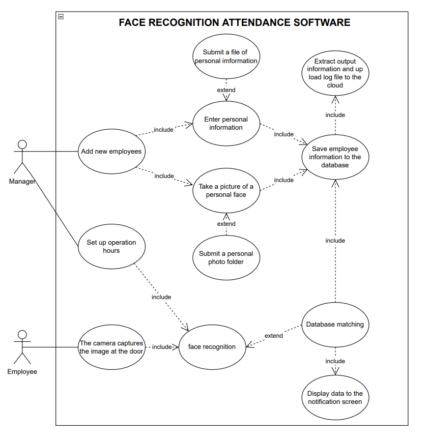
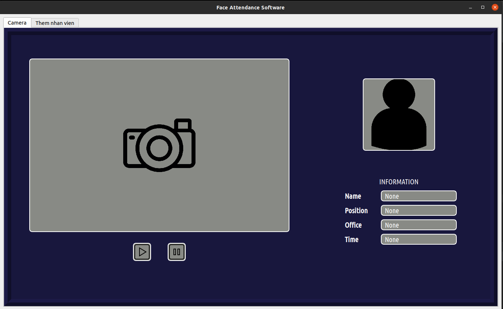
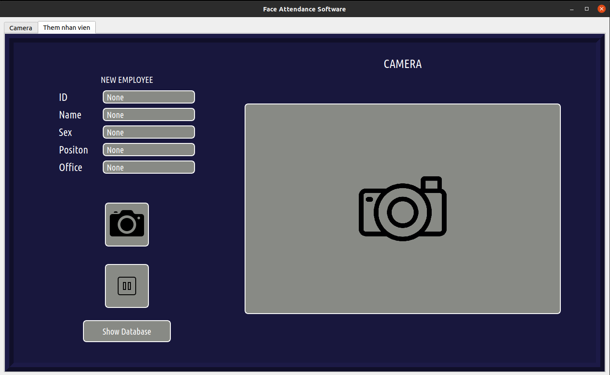
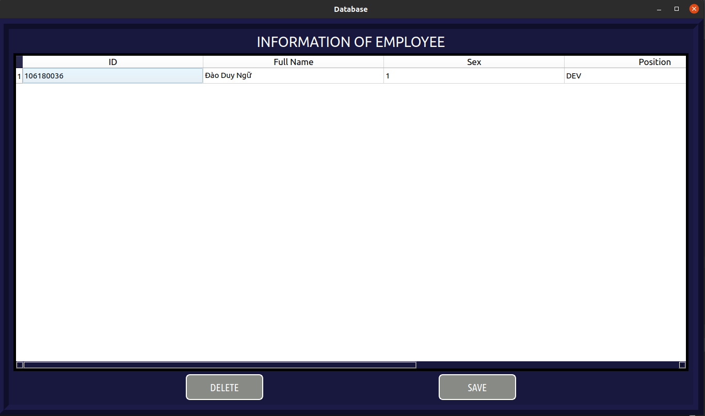

# Face Recognition Attendance
***
## Dev
```Cuong Tran```
```Duy Ngu Dao```
## Usage
***
### Install package
```
conda create --name facelog python=3.8
pip install -r requirements.txt
```
### Quick start
```python GUI.py```
## Summary
***
This is final project of Software technology 
- Attendance by Face each time per day
- Config Camera with URL
- Auto upload data to cloud each time per week
- Auto release old data 
- Add new Employee  

## Minimum 
***
```
CPU I3 2.0Ghz  
RAM 4GB  
Storage 1GB  
No GPU required
```
## GUI
***
- Interface of Attendance Camera

- Interface of Add New Employees

- Interface of Show Database

